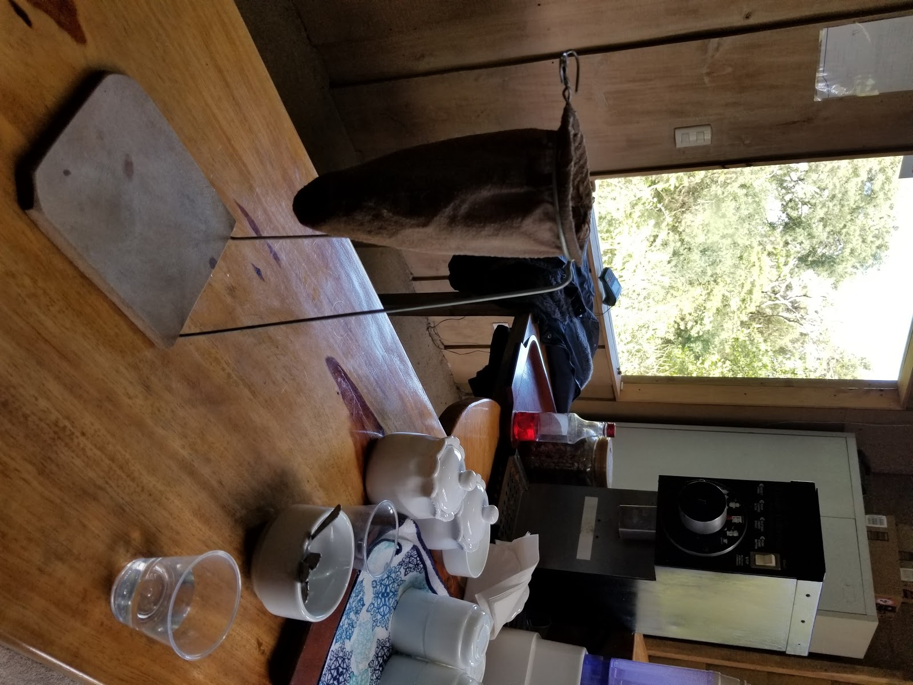
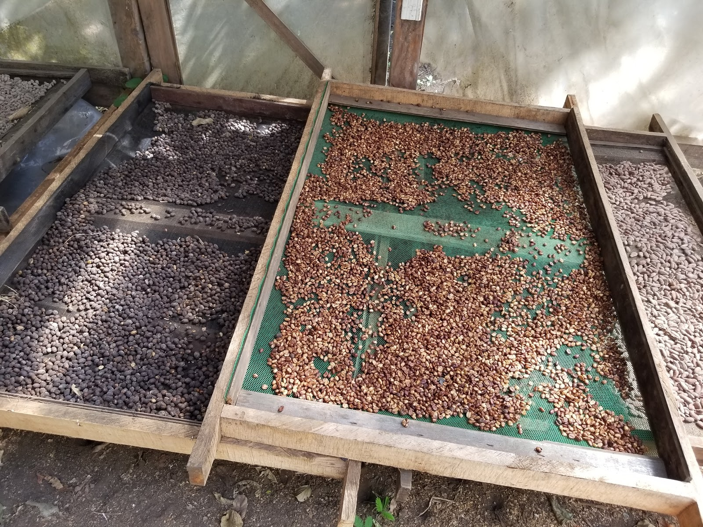

Before life came to a standstill, I had the great pleasure of visiting one of the great coffee nations, Costa Rica. I cut my return so close that I was immediately asked to quarantine for the week before everyone followed suit soon after. All that aside, I got to spend a week exploring the rainforest, sampling the local cuisine and drinking some excellent coffee.

The coffee highlight of the trip came on the first day, when we drove up the mountains of Monteverde, Costa Rica’s very own Vermont, to take a coffee tour of a small, locally run plantation. We had arrived late the night before, so I was floored to see all of the scenery in the morning sunlight. You can’t help but be struck by all of the vegetation around you. They very much earn the name “Green Mountains.”

The owners arrived shortly after we did, and were as kind as they were knowledgeable. We introduced ourselves as Americans; however, their eyes lit up when I told them I came from the Middle East and spoke Arabic. “Qahweh” or “Kahweh” is the arabic word for coffee, and the first recorded name for coffee as a drink. Prior to that, it was simply referred to as “black drink.”

Coffee has deep roots in the Middle East and Islam, having first been cultivated in Ethiopia and spread to Saudi Arabia. Alcohol is forbidden in Islam, so coffee took hold as an alternative to wine. Coffee was kept guarded closely for almost 200 years before being smuggled out of the Middle East by the Dutch in the 17th century, where it was then spread quickly to the rest of the world.

Introductions out of the way, we began the tour. He started by brewing us a few cups of coffee using the various methods at his disposal. There was a coffee machine, but also a french press, which he described as the “perfect” way to make coffee. The most unique method was called a “Chorreador,” which is a local coffee technique using a cotton sack propped up on a stand. 

The sack is filled with grounds and then hot water is poured over the top. Cotton does not have any flavors that could alter the taste of the cup. This results in a very pure, very delicious cup.

From there, we were taken to where they grew the beans. Coffee, for those like myself who did not know, come in small red or yellow seed pods. Each pod contains 3 or 4 beans which are coated in a sweet outer layer. The layer is dried off before roasting, which gives coffee its iconic bitter taste. Their roasting operation was small, and lacked any large machinery. They roasted it all on racks using the sun, which takes weeks to complete. The yield is not great, and the profits are slim (they resented the big chains like Starbucks in a major way). There was an assortment of tools for crushing, separating and drying, all of which used good old fashioned elbow grease to operate.

The next stop was a change of pace, as we took a short hike around the surrounding area. We saw gorgeous birds, a unique breed of bees with no stingers, and one incredibly venomous snake (he warned us right before we got too close). The amazing scenery was capped off by some juice that I got to squeeze myself using a large wheel. They gave us sugar cane, tangerines and lemon and let us have at it. Sugar cane juice, if you have not tried it, is amazing. Sweet, but accented perfectly by the citrus; I would highly recommend.

Finally, we capped off the tour back at the storefront, where we had some more coffee. We also got to see a few recipes made right in front of us using cocoa beans. Without milk and sugar, cocoa is quite bitter. But I gained a great appreciation for the taste as he started mixing it with various ingredients like cinnamon, cocoa butter, powdered milk and vanilla.

It was the perfect note on which to start my trip, and I encourage anyone who visits Costa Rica to pay them a visit at Coffee’N Jungle Tours and let them know Ramzi sent you. Please enjoy some of the photos I took below.
